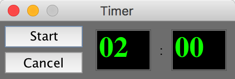

## Introduction
An always on top timer for the usage of presentation. 
For example, when you use PowerPoint to present and meanwhile, the audiences want to know how much time left

## Build
Import project into Eclipse directly

## Basic function
 1. Countdown
 2. Overtime warning and record the value of over time.

## Screenshot

